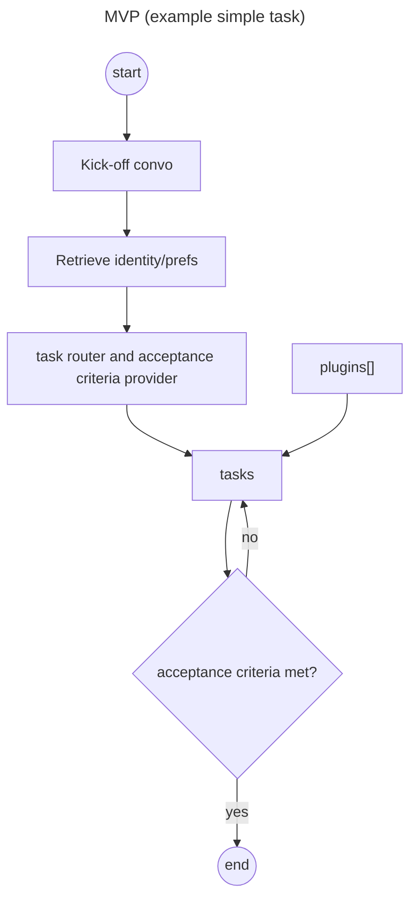

```mermaid
---
title: MVP (example simple task)
---
flowchart TD

    start(("start"))
    init["Kick-off convo"]
    ret_ident["Retrieve identity/prefs"]

    router_omni["task router and acceptance criteria provider"]
    tasks["tasks"]
    confirm_ac{"acceptance criteria met?"}

    plugins["plugins[]"]

    End(("end"))

    start --> init --> ret_ident --> router_omni
    router_omni --> tasks
    tasks --> confirm_ac
    confirm_ac --> |no| tasks
    plugins --> tasks
    confirm_ac --> |yes| End


```

### Limitations
- tasks parallelism?
- unclear goals/ac